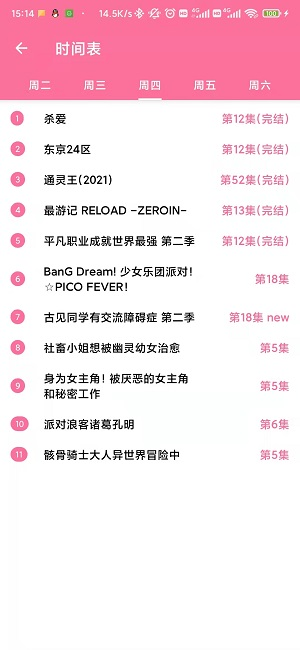

# SakuraAnime2Plugin

[**MediaBox插件**](https://github.com/RyensX/MediaBoxPlugin)示例-樱花动漫2

## 如何使用

自动安装

1. 下载安装[媒体盒子](https://github.com/RyensX/MediaBox/releases)
2. 启动媒体盒子打开插件仓库点击自动下载安装**樱花动漫2**
3. 启动插件

手动安装

1. 下载安装[媒体盒子](https://github.com/RyensX/MediaBox/releases)
2. 下载本项目[插件包](https://github.com/RyensX/SakuraAnime2Plugin/releases)
3. 选择插件包打开方式为**媒体盒子-插件安装**
4. 打开**媒体盒子**启动本插件

## 运行截图

 
 
 

## 免责声明

1. 此软件显示的所有内容，其**版权**均**归原作者**所有。
2. 此软件**仅可用作学习交流**，未经授权，**禁止用于其他用途**，请在下载**24小时内删除**。
3. 因使用此软件产生的版权问题，软件作者概不负责。
